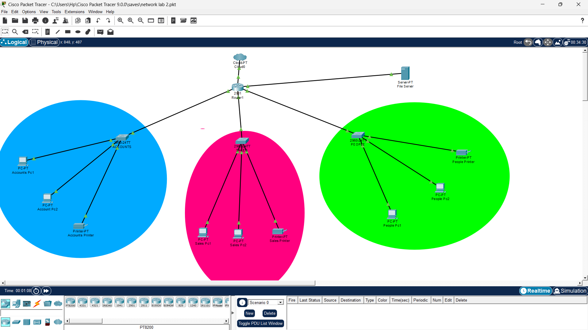
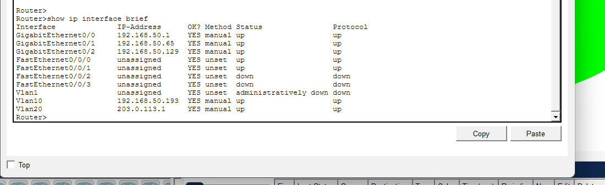
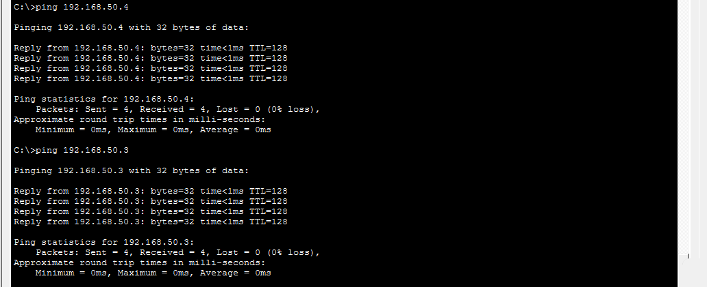

# Office Network Design & Configuration Lab (Cisco Packet Tracer)

## 📌 Project Overview

This project demonstrates the design and configuration of a segmented office network using Cisco Packet Tracer. The network connects three departments, Accounts, Delivery, and HR, through a single Cisco 2911 router and three switches. Each department has 2 PCs and a dedicated network printer. A file server sits on its own VLAN subnet connected to the router through a HWIC-4ESW module, making it equally accessible to all departments. An ISP cloud connection simulates internet access for the entire network.

Every IP address, subnet, and routing decision in this project was calculated deliberately. This document walks through the full design logic from subnetting calculations to device configuration and connectivity testing.

---

## 🧱 Network Topology

The network consists of:

- 1 Router (Cisco 2911 with HWIC-4ESW module)
- 3 Switches (Cisco 2960, one per department)
- 6 PCs (2 per department)
- 3 Network Printers (1 per department)
- 1 File Server (connected to router via HWIC-4ESW on VLAN 10)
- 1 ISP Cloud (connected to router via HWIC-4ESW on VLAN 20)

Device connections:
- Accounts Switch connects to Router GigabitEthernet0/0
- Delivery Switch connects to Router GigabitEthernet0/1
- HR Switch connects to Router GigabitEthernet0/2
- File Server connects to Router FastEthernet0/0/0 (VLAN 10)
- ISP Cloud connects to Router FastEthernet0/0/2 (VLAN 20)

---

## 📐 Subnetting Calculations

**Base Network:** `192.168.50.0/24`

The /24 prefix means the default subnet mask is `255.255.255.0`. In binary: 
11111111.11111111.11111111.00000000
^^^^^^^^
8 host bits available

### How Many Subnets Are Needed

4 internal subnets required:
- Accounts
- Delivery
- HR
- File Server

Plus 1 point-to-point subnet for the ISP link calculated separately using /30.

### Borrowing Bits
2^n = number of subnets
2^1 = 2 subnets   (not enough)
2^2 = 4 subnets   (exact fit)

2 bits borrowed from the host portion.

### New Subnet Mask

Original prefix:  /24
Bits borrowed:    2
New prefix:       /26
Binary:   11111111.11111111.11111111.11000000
Decimal:  255.255.255.192

### Block Size
256 - 192 = 64
Each subnet contains 64 addresses.

### Usable Hosts Per Subnet
8 - 2 = 6 remaining host bits
2^6 - 2 = 62 usable hosts per subnet

### Subnet Boundaries
Subnet 1:  192.168.50.0

Subnet 2:  192.168.50.64

Subnet 3:  192.168.50.128

Subnet 4:  192.168.50.192

### Internal Subnet Breakdown

**Subnet 1 (Accounts):**
Network:    192.168.50.0

Gateway:    192.168.50.1

Last Host:  192.168.50.62

Broadcast:  192.168.50.63

Mask:       255.255.255.192 (/26)

Hosts:      62

**Subnet 2 (Sales):**
Network:    192.168.50.64

Gateway:    192.168.50.65

Last Host:  192.168.50.126

Broadcast:  192.168.50.127

Mask:       255.255.255.192 (/26)

Hosts:      62

**Subnet 3 (People):**
Network:    192.168.50.128

Gateway:    192.168.50.129

Last Host:  192.168.50.190

Broadcast:  192.168.50.191

Mask:       255.255.255.192 (/26)

Hosts:      62

**Subnet 4 (File Server):**
Network:    192.168.50.192

Gateway:    192.168.50.193  (VLAN 10)

Last Host:  192.168.50.254

Broadcast:  192.168.50.255

Mask:       255.255.255.192 (/26)

Hosts:      62

### ISP Point-to-Point Link
2^2 - 2 = 2 usable hosts

Block size: 256 - 252 = 4

Network:    203.0.113.0

Router:     203.0.113.1  (VLAN 20)

ISP:        203.0.113.2

Broadcast:  203.0.113.3

Mask:       255.255.255.252 (/30)

Hosts:      2

### Full Subnetting Summary Table

| Subnet | Department | Network | First Host | Last Host | Broadcast | Mask | Hosts |
|--------|------------|---------|------------|-----------|-----------|------|-------|
| 1 | Accounts | 192.168.50.0 | 192.168.50.1 | 192.168.50.62 | 192.168.50.63 | /26 | 62 |
| 2 | Sales | 192.168.50.64 | 192.168.50.65 | 192.168.50.126 | 192.168.50.127 | /26 | 62 |
| 3 | People | 192.168.50.128 | 192.168.50.129 | 192.168.50.190 | 192.168.50.191 | /26 | 62 |
| 4 | File Server | 192.168.50.192 | 192.168.50.193 | 192.168.50.254 | 192.168.50.255 | /26 | 62 |
| 5 | ISP Link | 203.0.113.0 | 203.0.113.1 | 203.0.113.2 | 203.0.113.3 | /30 | 2 |

Number of subnets:      2^n       (n = bits borrowed)
Number of usable hosts: 2^h - 2   (h = remaining host bits)
Block size:             256 - last octet of subnet mask
Next subnet:            current network address + block size

### Why Each Decision Was Made

- **/26 for internal subnets:** 62 hosts per subnet covers each department comfortably with room to grow. Borrowing 2 bits produced exactly 4 subnets with no waste.
- **/30 for ISP link:** point-to-point links need only 2 addresses. Anything larger wastes address space.
- **VLAN 10 for File Server:** the HWIC-4ESW ports are switch ports and cannot accept IP addresses directly. VLAN 10 gives the file server its own isolated subnet routed through the same router.
- **VLAN 20 for ISP:** VLAN 20 isolates the ISP link from internal traffic and carries the default route out to 203.0.113.2.
- **Default route:** internal subnets are known to the router through directly connected routes. The default route sends all remaining traffic to the ISP.

---

## 🌐 IP Addressing Summary

- Subnet 1 (Accounts): `192.168.50.0/26`
- Gateway: `192.168.50.1`
- Broadcast: `192.168.50.63`
- 
- Subnet 2 (Sales): `192.168.50.64/26`
- Gateway: `192.168.50.65`
- Broadcast: `192.168.50.127`
- 
- Subnet 3 (People): `192.168.50.128/26`
- Gateway: `192.168.50.129`
- Broadcast: `192.168.50.191`
- 
- Subnet 4 (File Server): `192.168.50.192/26`
- Gateway: `192.168.50.193`
- Broadcast: `192.168.50.255`
- 
- Subnet 5 (ISP Link): `203.0.113.0/30`
- Router: `203.0.113.1`
- ISP: `203.0.113.2`

Internal Subnet Mask: `255.255.255.192`
ISP Link Subnet Mask: `255.255.255.252`

---

## 🔧 Router Configuration

**Router model:** Cisco 2911 with HWIC-4ESW module

**Interface mapping:**
- GigabitEthernet0/0 = Accounts Switch
- GigabitEthernet0/1 = Delivery Switch
- GigabitEthernet0/2 = HR Switch
- FastEthernet0/0/0 = File Server (VLAN 10)
- FastEthernet0/0/2 = ISP Cloud (VLAN 20)

**Commands Used:**

enable
configure terminal

interface GigabitEthernet0/0
ip address 192.168.50.1 255.255.255.192
no shutdown
exit

interface GigabitEthernet0/1
ip address 192.168.50.65 255.255.255.192
no shutdown
exit

interface GigabitEthernet0/2
ip address 192.168.50.129 255.255.255.192
no shutdown
exit

interface FastEthernet0/0/0
switchport mode access
switchport access vlan 10
no shutdown
exit

interface FastEthernet0/0/2
switchport mode access
switchport access vlan 20
no shutdown
exit

interface vlan 10
ip address 192.168.50.193 255.255.255.192
no shutdown
exit

interface vlan 20
ip address 203.0.113.1 255.255.255.252
no shutdown
exit

ip route 0.0.0.0 0.0.0.0 203.0.113.2
write memory
end

**Verification commands:**
show ip interface brief
show ip route

**Confirmed output:**
GigabitEthernet0/0    192.168.50.1      up    up

GigabitEthernet0/1    192.168.50.65     up    up

GigabitEthernet0/2    192.168.50.129    up    up

Vlan10                192.168.50.193    up    up

Vlan20                203.0.113.1       up    up

---

## 💻 Host Configuration

**Accounts PC1:**
- IP: `192.168.50.2`
- Mask: `255.255.255.192`
- Gateway: `192.168.50.1`

**Accounts PC2:**
- IP: `192.168.50.3`
- Mask: `255.255.255.192`
- Gateway: `192.168.50.1`

**Accounts Printer:**
- IP: `192.168.50.4`
- Mask: `255.255.255.192`
- Gateway: `192.168.50.1`

**Sales PC1:**
- IP: `192.168.50.66`
- Mask: `255.255.255.192`
- Gateway: `192.168.50.65`

**Sales PC2:**
- IP: `192.168.50.67`
- Mask: `255.255.255.192`
- Gateway: `192.168.50.65`

**Sales Printer:**
- IP: `192.168.50.68`
- Mask: `255.255.255.192`
- Gateway: `192.168.50.65`

** People PC1:**
- IP: `192.168.50.130`
- Mask: `255.255.255.192`
- Gateway: `192.168.50.129`

**People PC2:**
- IP: `192.168.50.131`
- Mask: `255.255.255.192`
- Gateway: `192.168.50.129`

**People Printer:**
- IP: `192.168.50.132`
- Mask: `255.255.255.192`
- Gateway: `192.168.50.129`

**File Server:**
- IP: `192.168.50.194`
- Mask: `255.255.255.192`
- Gateway: `192.168.50.193`

**ISP Cloud:**
- IP: `203.0.113.2`
- Mask: `255.255.255.252`

---

## 🖥 File Server Configuration

- Device type: Server
- Connected to Router FastEthernet0/0/0 via HWIC-4ESW module
- Assigned to VLAN 10 on the router
- IP: `192.168.50.194`
- Gateway: `192.168.50.193`
- FTP service enabled under the Services tab
- Username: admin / Password: admin
- Accessible from all three departments through the router

---

## ✅ Verification & Testing

**From Accounts PC1:**
ping 192.168.50.3

ping 192.168.50.4

ping 192.168.50.66

ping 192.168.50.130

ping 192.168.50.194

ping 203.0.113.2

**From Sales PC1:**
ping 192.168.50.67

ping 192.168.50.68

ping 192.168.50.2

ping 192.168.50.130

ping 192.168.50.194

**From People PC1:**
ping 192.168.50.131

ping 192.168.50.132

ping 192.168.50.2

ping 192.168.50.66

ping 192.168.50.194

---

**Results:**
- Successful communication between all three departments
- All departments reached their local printer
- All departments reached the file server at `192.168.50.194`
- Default route confirmed in routing table via show ip route
- Router forwarded traffic correctly across all subnets and to ISP

---

## 📋 Full Device IP Summary

| Device | IP Address | Subnet Mask | Gateway |
|--------|------------|-------------|---------|
| Router Gi0/0 | 192.168.50.1 | 255.255.255.192 | |
| Router Gi0/1 | 192.168.50.65 | 255.255.255.192 | |
| Router Gi0/2 | 192.168.50.129 | 255.255.255.192 | |
| Router Vlan10 | 192.168.50.193 | 255.255.255.192 | |
| Router Vlan20 | 203.0.113.1 | 255.255.255.252 | |
| ISP Cloud | 203.0.113.2 | 255.255.255.252 | |
| Accounts PC1 | 192.168.50.2 | 255.255.255.192 | 192.168.50.1 |
| Accounts PC2 | 192.168.50.3 | 255.255.255.192 | 192.168.50.1 |
| Accounts Printer | 192.168.50.4 | 255.255.255.192 | 192.168.50.1 |
| Delivery PC1 | 192.168.50.66 | 255.255.255.192 | 192.168.50.65 |
| Delivery PC2 | 192.168.50.67 | 255.255.255.192 | 192.168.50.65 |
| Delivery Printer | 192.168.50.68 | 255.255.255.192 | 192.168.50.65 |
| HR PC1 | 192.168.50.130 | 255.255.255.192 | 192.168.50.129 |
| HR PC2 | 192.168.50.131 | 255.255.255.192 | 192.168.50.129 |
| HR Printer | 192.168.50.132 | 255.255.255.192 | 192.168.50.129 |
| File Server | 192.168.50.194 | 255.255.255.192 | 192.168.50.193 |

---

## 🛠 Key Skills Demonstrated

- Network Topology Design
- IP Addressing and Subnetting (/26 internal, /30 ISP link)
- Binary to Decimal Subnet Mask Conversion
- Block Size and Host Range Calculation
- Cisco 2911 Router Configuration via CLI
- HWIC-4ESW Module Installation and Configuration
- VLAN Assignment on Router Switch Ports
- Multi-Department Network Segmentation
- Network Printer Deployment and Configuration
- Dedicated Server Subnet Design
- ISP Cloud Integration and Default Route Configuration
- File Server Deployment and FTP Configuration
- Cross-Subnet Connectivity and Routing
- Network Troubleshooting and Verification

